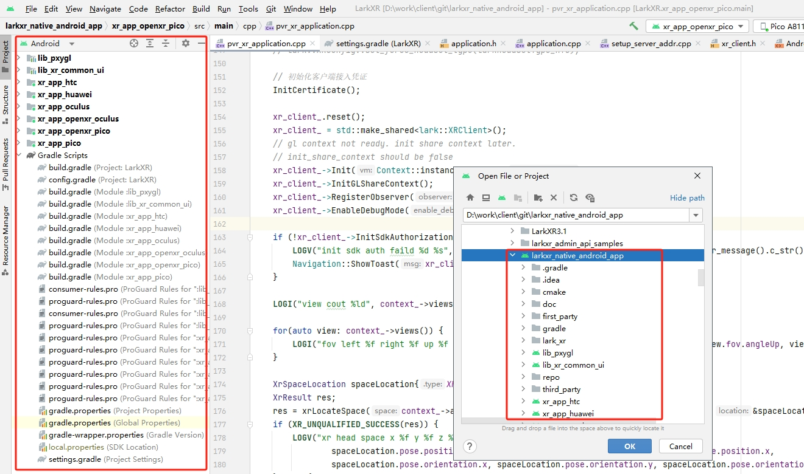
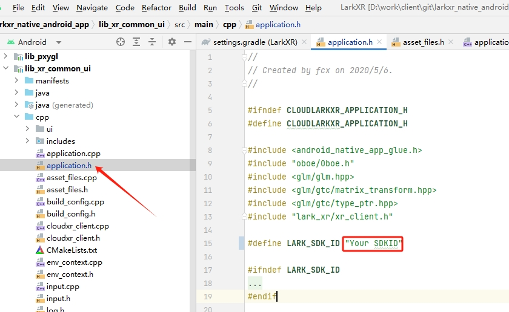
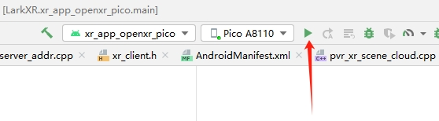

# Lark VR Andorid Apps

---

[English](./README.md) [中文](./README.zh_CN.md)

---

Demos show how to build cloudrending app with multi headset sdk, Meta openxr sdk for oculus, HTC Wave sdk fo HTC Foucus, Pico openxr sdk fro Pico Neo, use LarkVR Android SDK.

Links：

[Paraverse](https://www.paraverse.cc/)

[LarkSR Doc](https://www.pingxingyun.com/devCenter.html)

[Experience](https://www.paraverse.cc/)

Folder:

```path
cmake-----------------------------cmake config
doc-------------------------------
lib_pxygl-------------------------Support VR render opengl api.
lib_xr_common_ui------------------APP common ui for all three demo.
xr_app_htc------------------------HTC focus headset.
xr_app_huawei---------------------Huawei VR headset
xr_app_oculus---------------------Meta Oculus Quest headset(Sys < 46.0, old meta native sdk)
xr_app_openxr_oculus--------------Meta Oculus Quest headset(new meta openxr sdk)
xr_app_openxr_pico----------------Pico4/Pico Neo3 headset
third_party-----------------------
```

## Setup

1. The total `larkxr_native_android_app` root folder is a android studio project need android sdk and ndk.



2. Setup sdkid. Just change #define LARK_SDK_ID "your sdk id" in lib_xr_common_ui/src/main/cpp/application.h and build the project.



3. Connect your headset to android studio select and run with your headset type.



[API DOC](./doc/README.md)

[Update DOC](./doc/update.md)

## With CloudXR

1. Enable cloudxr support must put your CloudXR.aar under third_party/cloudxr dir and set BUILD_WITH_CLOUDXR_SUPPORT = true in config.gradle
2. The project can be just a simple cloudxr client with simple opengl ui (libpxygl and lib_xr_common_ui). More details about cloudxr and openxr see xr_app_openxr_oculus source ( oxr_application.cpp cloudxr_client_ ) and just ignore lark::XRClient if you dont need it.

## Lark VR SDK

- [:heavy_check_mark:] [Meta Qculus Quest(Include > 46.0)](https://www.oculus.com/quest-2/)
- [:heavy_check_mark:] [HTC Focus](https://www.vive.com/cn/product/vive-focus/)
- [:heavy_check_mark:] [Pico4/Pico Neo3](https://www.pico-interactive.com/)
- [:heavy_check_mark:] [Nolo Sonic](https://www.nolovr.com/index)
- [:heavy_check_mark:] [Qiyu](https://dev-qiyu.iqiyi.com/)
- [:heavy_check_mark:] [Nreal](https://www.nreal.cn/nrealapp/)
- [:heavy_check_mark:] [Huawei](https://developer.huawei.com/consumer/cn/vr/)

## code style

[Google C++ Style Guide](https://google.github.io/styleguide/cppguide.html)
