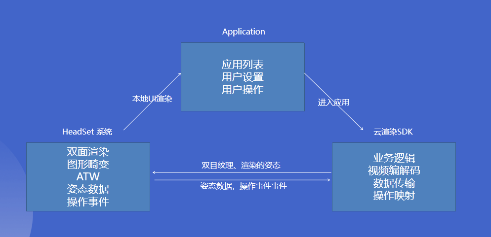

# 云雀 VR SDK

## 简介

云雀 VR SDK 负责连接云雀服务器和连接云端渲染。主要支持 Android 平台的 VR 一体机。使用 Anroid OpenGL ES 渲染。提供原生 C++ 和 Java 接口以及与 VR 头盔SDK集成的 DEMO。

由于不同品牌 VR 头盔一体机开发平台，使用逻辑，对外接口存在差异，只提供与 VR 头盔原生 SDK 集成的具体 DEMO, 能保证比较好的效果。目前提供 Oculus 平台 Demo(主要适配 Oculus Quest)，HTC 平台 Demo(主要适配 HTC Focus 系列，Pico 部分型号)，Pico 平台(主要适配 PicoNeo2)。

VR 一体机提供的其他开发平台如 Untiy3D 等，云雀虽然提供 C 接口的封装的调用，可不保证 VR 一体机SDK中有适合云渲染的接口或使用方法，不保证能实现同原生SDK同样的效果，不会提供相关集成 Demo, 除云雀 VR SDK 本身的问题外不提供其他平台的技术支持。

两部分主要业务：

1. 云雀后台服务器。
云雀 VR SDK 中封装后台服务器的 Restful 接口。主要包括获取应用列表，进入应用，后台上下线等接口。
后台服务器负责管理客户端和分配云雀应用服务器渲染节点。
2. 云雀应用服务器。云雀渲应用服务器负责云端渲染和视频流推送。云雀VR SDK 中封装登录，连接，渲染，指令传递等操作。

简单业务流程：

1. 获取应用列表。
2. 用户选择一个应用，调用进入接口，后台服务器分配渲染节点并返回相关连接参数。
3. 使用连接参数登录渲染节点，登录认证成功后启动 VR 线程。
4. 连接成功开始云端渲染。每帧提交姿态数据，渲染云端渲染帧。
5. 关闭连接, 渲染本地。




> Left: CloudAPP INPUT Right: SDK output


> Simulation of VR headset output

## 目录结构

本 SDK 目录结构如下:

```path
-[cmake]---------------Demo中用到的辅助 cmake 脚本。
-[demo]----------------基于云雀SDK的原生Demo。
-[first_party]---------Demo中生成的库，主要为通用 ui 和 openg封装。
-[lark_xr]-------------云雀VR SDK，包括头文件，动态库文件，用于NDK编译。
-[third_party]---------第三方库目录。包括基础库如Poco，VR SDK 等。
```

### demo 项目结构

demo 项目分为以下几个子项目。Demo 使用的 Android Studio 版本为 4.0.1，gradle plugin 版本为 4.0.1，gradle 版本为 6.1.1，NDK 版本为 21.3.6528147。

不同版本的开发环境可能会导致编译问题，请尽量选择与 Demo 中相同的开发环境，否证可能需要手动修改项目配置。

* lib_pxygl 通用 opengl 相关调用的封装

* lib_xr_common_ui 所有 demo app 的 UI 和通用组件

* xr_demo_htc htc 平台的 demo

* xr_demo_oculus oculus 平台的 demo

* xr_demo_pico pico 平台的 demo

### SDK 目录接口

由于使用 NDK 开发，除了要在 gradle 中引用 larkxr-kit-3.1.0.0-build-1.aar 外，还要在 cmake 中配置 larkxr sdk 的头文件和动态库。

* include 头文件目录，包含 c++ 和 c 两套头文件
* lib 动态库文件目录，目前只包含 Android 平台
* larkxr-kit-3.1.0.0-build-1.aar Android 库文件

## Java 接口（只用于初始化和生命周期）

### XrSystem

XrSystem.java 是主要的 java 接口，用于初始化系统信息。应在 Android Activity 中使用。管理Android生命周期相关资源。

* init方法初始化系统信息。应在系统初始时调用。如 Activity 的 onCreate 函数中。

```java
xrSystem = new XrSystem();
xrSystem.init(this);
```

* 生命周期函数，onResume，onPause，onDestroy，应在 Android 相应生命周期内调用。

```java
@Override
protected void onResume() {
    super.onResume();
    Log.d(TAG, "java activity onResume");
    xrSystem.onResume();
}
@Override
protected void onPause() {
    super.onPause();
    Log.d(TAG, "java activity onPause");
    xrSystem.onPause();
}

@Override
protected void onDestroy() {
    super.onDestroy();
    Log.d(TAG, "java activity onDestroy");
    xrSystem.onDestroy();
}
```

## c++ 接口（实际渲染相关）

### xr_client.h

#### 主要接口

XRClient 是 larkxr sdk 的核心类，大部分业务逻辑包括初始化，生命周期，进入应用，发送姿态数据，获取渲染纹理都是在 XRClient 类下进行的。 XRClient 主要接口如下.

* 初始化

初始化

```c++
/**
* 安卓平台初始化 sdk。
* @param vm java 虚拟机
* @param init_share_context 是否立即初始化 opengl 上下文。如果调用 init 方法不在渲染线程或渲染环境
* 可能会变动的情况下，init_share_context 传入 false，然后手动调用 InitGLShareContext。如果渲染线程
* 不会变化可以直接在 init 方法初始化。
*/
void Init(JavaVM* vm, bool init_share_context = true);
/**
* 初始化opengl共享上下文
* 必须在 opengl渲染线程中调用
*/
void InitGLShareContext();
/**
*
*/
void ReleaseGLShareContext();
```

验证 SDK 授权，授权 id 请联系商务开通。

```c++
/**
 * 初始化 larkxr SDK，应在larkxr 系统初始化完成之后调用。如果初始化失败将返回false。
 * 可通过 last_error_code 和 last_error_message 获取错误信息。
 * 授权 id 应从商务处获取正确的 id。
 * APP 首次启动将连接网络进行授权验证。授权成功之后在授权有效期内可不连接外网。
 * @param id 授权id
 * @return 成功 true 失败返回 false
 */
bool InitSdkAuthorization(const std::string& id);
```

应在 java 接口初始化完成之后初始化 SDK，初始化成功之后 SDK 功能才能正常使用。调用示例：

```c++
// 初始化 lark sdk
xr_client_.Init(java_.Vm);
// 验证授权
if (!xr_client_.InitSdkAuthorization(LARK_SDK_ID)) {
    LOGV("init sdk auth faild %d %s", xr_client_.last_error_code(), xr_client_.last_error_message().c_str());
    Navigation::ShowToast(xr_client_.last_error_message());
}
```

* 系统生命周期相关函数

```c++
// 系统创建时调用。如果此时配置了云雀服务器地址，将在后台上线。
void OnCreated();
// 系统从休眠中恢复时调用，如果此时配置了云雀服务器地址，将在后台下线。
void OnResume();
// 系统休眠时调用，如果此时配置了云雀服务器地址，将在后台下线。
void OnPause();
// 系统销毁时调用。如果此时配置了云雀服务器地址，将在后台下线。
void OnDestory();
```

* 设置云雀服务器地址

```c++
/**
 * 设置云雀服务器地址
 * @param ip 云雀服务器 ip
 * @param port 云雀服务器端口号
 */
void SetServerAddr(const std::string& ip, int port);
```

* 设置客户端凭证

```c++
/**
 * 设置客户端管理接入凭证; 云雀后台系统设定接入管理中设置
 * @param appKey admin_key
 * @param appSecret admin_secret
 */
static void SetCertificate(const std::string& appKey, const std::string& appSecret);
```

* 设置电量

```c++
/**
* 头盔电量信息 百分比
* @param level
*/
static void SetHmdBatteryLevel(int level);
/**
* 手柄电量信息 百分比
* @param left
* @param right
*/
static void SetControlerBatteryLevel(int left, int right);
/**
* 手柄电量
* @param isLeft
* @param level
*/
static void SetControlerBatteryLevel(bool isLeft, int level);
```

* 注册/取消回调函数

```c++
/**
* 注册回调函数
* @param observer 回调函数指针
*/
void RegisterObserver(XRClientObserver* observer);
/**
* 取消注册回调函数
*/
void UnRegisterObserver();
```

* 进入/关闭应用

进入应用接口调用成功之后将开始连接云端服务器流程，过程中相关错误或事件通过回调函数返回。

```c++
/**
 * 使用应用 id 进入云端应用。
 * 云端应用 id 从应用列表接口回调处获取。
 * @param appliId 云端应用id
 */
void EnterAppli(const std::string& appliId);
/**
 * 使用手动配置进入云端应用。一般情况下不需要手动调用该接口。
 * @param config 完整配置。
 */
void Connect(const CommonConfig& config);
/**
 * 主动关闭与云端的连接
 */
void Close();
```

* 姿态数据信息

设备的姿态数据和输入状态（手柄按键等）通过`larkxrTrackingDevicePairFrame`结构体封装。

当连接成功时应以符合头盔刷新频率发送姿态数据。可在`RequestTrackingInfo`回调中发送，该回调函数将以固定频率调用，断开连接后将停止调用。

```c++
/**
* 立即发送设备的姿态数据信息并缓存下来。
* @param devicePair 设备的姿态数据信息。
*/
void SendDevicePair(const larkxrTrackingDevicePairFrame& devicePair);
/**
* 发送上一次缓存的姿态数据
*/
void SendDevicePair();
```

* 渲染相关

配合 `OnTrackingFrame`回调函数使用。

```c++
/**
 * 检测是否收到新的帧
 * @return
 */
bool HasNewFrame();
/**
 * 渲染一个 tracking 帧，只有当当前有未渲染的新的 tracking 帧时才会返回成功。
 * @param trackingFrame trakcing 数据
 * @return 是否成功
 */
bool Render(larkxrTrackingFrame* trackingFrame);
```

* 错误信息

错误信息可通过 last error 的状态获取或通过回调函数 OnError 获取。

```c++
/**
 * 事件码。完整的事件码参照枚举 larkEventTypes
 * 当有新事件发生时该值会被更新，否则将保留。
 * @return 事件码。
 */
int last_error_code();
/**
 * 错误信息。跟 last_error_code 同步更新。
 * @return 错误信息。
 */
std::string last_error_message();
/**
 * 清理事件信息。
 */
void ClearError();
```

* 数据通道

```c++
/**
    * 发送自定义数据给云端应用
    * @param buffer
    * @param length
    */
void SendData(const char* buffer, int length);
/**
    * 发送自定义数据给云端应用
    * @param buffer
    * @param length
    */
void SendData(const std::string& data);
```

* 音频数据

```c++
/**
* 发送音频数据给云端
* @param buffer
* @param length
*/
void SendAudioData(const char* buffer, int length);
```

#### 回调函数

XRClientObserver 类包含需要实现的纯虚函数。注册为 XRClient 的回调函数成功后将根据具体情况调用。 需要注意所有回调函数都不保证在 opengl 渲染线程下调用。需要注意需要在 opengl 渲染线程的操作。

* 授权检测

```c++
/**
 * lark xr sdk 授权检测失败时回调。
 * @param code sdk 授权错误码。@see larkEventTypes
 * @param msg 授权失败具体错误信息
 */
virtual void OnSDKAuthorizationFailed(int code, const std::string& msg) = 0;
```

* 连接过程回调

```c++
/**
* 连接服务器成功时回调
*/
virtual void OnConnected() = 0;
/**
*  与服务器连接关闭时回调
* @param code 关闭原因 枚举原因@see larkEventTypes。一般有：
*             LK_XR_UDP_CHANNEL_USER_CANCEL 用户主动关闭
*             LK_PROXY_SERVER_CLOSE 与代理服务器的连接关闭
*             LK_RENDER_SERVER_CLOSE 与渲染服务器的连接关闭
*             LK_XR_UDP_CHANNEL_CLOSED 媒体 udp 通道关闭
*/
virtual void OnClose(int code) = 0;
/**
* 媒体 udp 通道关闭时回调。当vr头盔待机时，xrclient 将主动关闭媒体连接减少耗电和流量。
*/
virtual void OnStreamingDisconnect() = 0;
```

* 一般信息

```c++
/**
* 返回一般事件信息
* @param infoCode  事件码在@see larkEventTypes 枚举中
* @param msg 信息说明,可能为空
*/
virtual void OnInfo(int infoCode, const std::string& msg) = 0;
/**
* 出现错误时回调。当出现错误时当前连接已不可用。连接将断开。
* @param errCode 事件码在@see larkEventTypes 枚举中
* @param msg 错误信息。
*/
virtual void OnError(int errCode, const std::string& msg) = 0;
```

* 解码和渲染

```c++
/**
* 当使用软解码视频解码成功时回调。
* Android 平台固定使用硬件解码。不会回调该函数。
*/
virtual void OnMediaReady() = 0;
/**
* 硬件解码成功时回调。
* 返回 opengl GL_TEXTURE_2D 类型纹理。为云端渲染好的左右眼图像。
* --------------
* |  L   |  R  |
* --------------
* 图像如上图所示。该纹理在 larkxr sdk 更新。
* 该回调每次连接成功之后回调一次。
* 之后收到OnTrackingFrame回调时，将 tracking frame 用与 atw 渲染该纹理。
* @param nativeTextrure opengl 纹理 id
*/
virtual void OnMediaReady(int nativeTextrure) = 0;
/**
* 收到软件解码好的一帧。
* 包括 tracking 数据帧和视频帧。
* 只会在使用软解码的系统回调。
* @param frame tracking 数据帧和视频帧
*/
virtual void OnTrackingFrame(std::unique_ptr<XRTrackingFrame>&& frame) = 0;
/**
* 收到的云端渲染好的 tracking 数据帧，只在使用硬件解码器的系统回调。
* 该 tracking 帧用于 vr 头盔进行 atw 渲染。在未收到 tracking 帧的情况下应跳过渲染循环。
* 具体 tracking 数据的使用方法根据不同的 vr 头盔sdk 不同，应参考附带的demo中的使用方法。
* 由于云渲染是完全异步的过程，该 tracking 数据是之前发送给云端的 tracking 数据而不是当前最新的，
* 请不要直接使用从 vr 头盔 sdk 中获取的最新的 tracking 数据渲染云端纹理。
* @param trackingFrame tracking 数据帧。
*/
virtual void OnTrackingFrame(const larkxrTrackingFrame& trackingFrame) = 0;
/**
* xrclient 请求获取 tracking 数据。
* xrclient 连接成功之后将已固定的频率请求 tracking 数据。
* 在该回调中将从 vr 头盔中获取到的 tracking 数据发送给 xrclient。
*/
virtual void RequestTrackingInfo() = 0;
```

* 后台客户端 Id

```c++
/**
* 收到云雀后台分配的客户端 id。用于后台区分客户端和后台启动应用管理等操作。
* @param clientId 客户端 id。
*/
virtual void OnClientId(const std::string& clientId) = 0;
```

* 手柄震动

```c++
/**
 * 收到手柄震动请求
 * 需要注意不同 vr 头盔手柄震动调用方式不同，需要区别对待。具体用法参考相关 demo
 * @param isLeft 是否是左手柄
 * @param startTime 开始时间
 * @param amplitude 震动强度
 * @param duration 震动持续时间
 * @param frequency 震动频率
 */
virtual void OnHapticsFeedback(bool isLeft, uint64_t startTime, float amplitude, float duration, float frequency) = 0;
/**
* 请求同步玩家区域数据
*/
virtual void OnSyncPlayerSpace(larkxrPlaySpace* playSpace) = 0;
/**
* 数据通道开启
*/
virtual void OnDataChannelOpen() = 0;
/**
* 数据通道关闭
*/
virtual void OnDataChannelClose() = 0;
/**
* 收到二进制数据
*/
virtual void OnDataChannelData(const char* buffer, int length) = 0;
/**
* 收到字符数据
*/
virtual void OnDataChannelData(const std::string& data) = 0;
```

### 其他

#### 获取应用列表和运行模式

AppListTask 类用于获取应用列表和运行模式。内部 task 将定时调用，并在回调函数中更新。

* 回调数据

```c++
// 获取到应用列表
virtual void OnAppListInfo(const std::vector<AppliInfo>& appliInfo) = 0;
// 带分页数据应用列表，与 OnAppListInfo 同时回调，可以只关注一个
virtual void OnAppListPageInfo(const AppliPageInfo& appliPageInfo) = 0;
// 调用接口的错误信息
virtual void OnFailed(const std::string& msg) = 0;
// 运行模式
// 当运行模式为教师集中控制时，应隐藏实际应用列表，从后台启动应用。
virtual void OnRunMode(GetVrClientRunMode::ClientRunMode runMode) = 0;
```

#### 配置

XRConfig 包含一般配置的静态变量和默认值定义。

```c++
// 渲染的宽，为左右眼加在一起的宽度
static int render_width;
// 渲染的高度。
static int render_height;
// 分辨率缩放 0 - 2
// 最终分辨率为 align32(render_width * resolution_scale); align32(render_height * resolution_scale)
static float resolution_scale;
// 比特率。单位 kbps.
static int bitrate;
// 帧率
static int fps;
// @Deprecated 已弃用.使用头盔姿态的 tracking origin 等功能和安全区域配合使用
// steam vr 设置的初始房间高度
static float room_height;
// 瞳距
static float ipd;
// 提交给云端 vr 渲染用的 fov。fov 应从 vr 头盔sdk中获取正确的值。以度数为单位。
// 部分 vr 头盔的左右眼 fov 是非对称的。
static larkxrRenderFov fov[2];
// @Deprecated 已弃用，使用 stream_type 替代
// 是否使用增强协议连接媒体
static bool use_kcp;
// 是否使用 h265
static bool use_h265;
// 是否启用手柄的震动反馈
static bool use_haptics_feedback;
// 是否将视频画面左右眼渲染到同一纹理上
static bool use_multiview;
// 是否将视频画面翻转渲染
// 上下翻转
static bool flip_draw;
// 0.005 (3.1.8.0新增)
static float seconds_from_vsync_to_photons;
// 是否启用 10 bit 编码 (3.1.8.0新增)
static bool use_10bit_encoder;
// 是否上报 fec 失败，当当前 fec 实效时通知服务端加大冗余包 (3.1.8.0新增)
static bool report_fec_failed;
// 头盔类型设置，将根据具体头盔的类型选择steamvr中用的手柄和绑定文件 (3.1.8.0新增)
static larkHeadSetControllerDesc headset_desc;
// 集中渲染设置 (3.1.8.0新增)
static larkFoveatedRendering foveated_rendering;
// 颜色校正设置 (3.1.8.0新增)
static larkColorCorrention color_corrention;
// 设置使用的传输通道类型，目前有 udp，tcp，增强udp可选 (3.1.8.0新增)
static larkStreamType stream_type;
// 是否使用渲染队列 (3.1.8.0新增)
static bool use_render_queue;
static QuickConfigLevel quick_config_level;
```

#### 延时收集

XRLatencyCollector 负责延时收集，大部分延时手机在 sdk 内部完成。但最终提交和渲染应在应用实际渲染时调用。Rendered2 和 Submit 两个延时收集点应在应用中调用

```c++
// opengl 渲染时调用，一般为渲染到 framebuffer 时。
void Rendered2(uint64_t frameIndex);
// 提交给 vr 头盔sdk 时调用。
void Submit(uint64_t frameIndex, float blackDegree);
```

## C 接口

C 接口是对上面基本业务流程 c++ 接口的封装。主要包含如下使用流程：

由于 VR 头盔 SDK 的差异，不提供具体集成 VR 头盔 SDK 的调用 C 接口的 DEMO，C 接口作为保留和测试使用。

```c++
/***
* 云雀 VR SDK 主要调用如下.
* larkxr_InitSdkAuthorization------------初始化SDK ID
*  larkxr_InitContext--------------------初始化系统上下文
*  larkxr_InitRenderInfo-----------------初始化渲染信息
*          |
*          |
*  larkxr_IsConnected--------------------是否连接成功
*          |
*          |
*    larkxr_IsFrameInited----------------渲染纹理是否初始
*    larkxr_GetRenderTexurte-------------获取纹理并初始化渲染
*          |
*  larkxr_UpdateDevicePose---------------更新姿态
*  larkxr_UpdateControllerInputState-----更新手柄状态
*          |
*          |-------| loop
*          |       |
*    larkxr_Render-| --------------------渲染。如果没有新的帧应跳过本次渲染
*          |       |
*          |-------|
*          |
*   larkxr_IsConnected------------------连接关闭结束渲染更新循环
*          |
*          |
*   larkxr_ReleaseContext------------------清理系统上下文
*/
```
